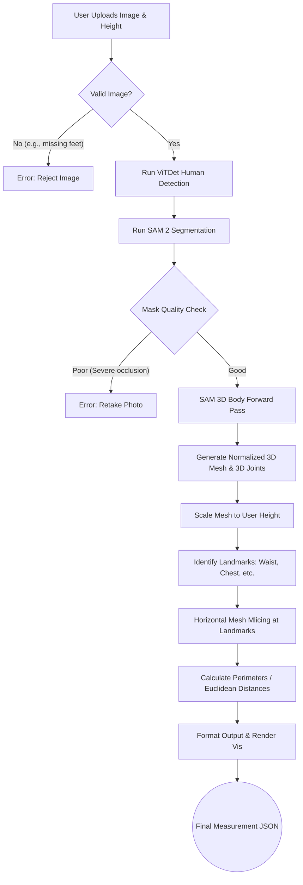

# AI Body Measurement Extraction: Project Overview

This document outlines the architecture, pipeline, and requirements for building an automated body measurement extraction system using a single 2D image powered by the **SAM 3D Body** model.

## 1. Step-by-Step Process Description

### Phase 1: Ingestion & Pre-processing
1. **User Input:** The user provides two things: A single full-body 2D image and their physical ground-truth height (e.g., 175 cm).
2. **Detection & Segmentation:** 
   - A bounding box detector (like `ViTDet`) locates the human in the frame.
   - **SAM 2** (Segment Anything 2) uses the bounding box as a prompt to generate a highly precise 2D binary mask of the user, separating them cleanly from the background.

### Phase 2: 3D Generation & Parameterization
3. **3D Mesh Recovery:** The cropped image and the SAM mask are fed into the **SAM 3D Body** encoder-decoder network.
4. **Output Generation:** The model outputs the **Momentum Human Rig (MHR)** parameters. This translates directly into:
   - A dense 3D surface mesh containing thousands of vertices (the volume of the body).
   - 3D structural joint locations (the skeleton).

### Phase 3: Calibration & Measurement
5. **Scale Calibration:** The raw 3D mesh exists in a normalized space. The system calculates the distance from the top-most vertex (head) to the bottom-most vertex (feet) and scales the entire mesh uniformly so this distance matches the user's ground-truth height.
6. **Landmark Extraction:** The system queries the 3D joint locations to geometrically locate the exact heights of the chest, true waist, hips, and crotch.
7. **Mesh Slicing & Extraction:**
   - Using a 3D geometry library, the system "slices" the 3D mesh horizontally at those specific landmark heights.
   - It calculates the path length (perimeter) of the resulting 2D polygonal slice. This gives the exact girth (chest, waist, hips).
   - Linear measurements (like inseam) are calculated by measuring the Euclidean distance between scaled 3D joints (e.g., Crotch joint to Ankle joint).

---

## 2. Requirements

### Software & Libraries
* **Core Environment:** Python 3.11+, PyTorch 2.0+
* **Vision & AI Models:** 
  * `SAM 3D Body` (Core mesh recovery)
  * `detectron2` / `ViTDet` (Human bounding box detection)
  * `SAM 2` (High-fidelity segmentation masking)
  * `MoGe2` (Optional, for field-of-view estimation to correct camera distortion)
* **3D Geometry Processing:**
  * `trimesh` or `PyTorch3D` (Crucial for slicing the 3D mesh and calculating the perimeter of the slices).
* **General Tools:** `opencv-python` (Image handling), `numpy`, `scipy`.

### Input Image Guidelines
For accurate measurements, the input image must meet strict criteria:
* **Resolution:** Minimum 1080p recommended to ensure clear boundary edges.
* **Pose:** 'A-Pose' (standing straight, feet shoulder-width apart, arms slightly raised and separated from the torso).
* **Clothing:** Form-fitting athletic wear. **Loose clothing will add artificial volume to the 3D mesh and ruin girth measurements.**
* **Camera Setup:** The camera should be at waist-height, parallel to the subject to minimize vertical perspective distortion. The entire body (head to toe) must be visible.

---

## 3. Process Flowchart



---

## 4. Expected Outputs

### Data Output (JSON)
The measurement algorithms will parse the calculations into a standardized JSON response:

```json
{
  "status": "success",
  "metadata": {
    "user_height_cm": 175.0,
    "scale_factor": 1.284
  },
  "measurements_cm": {
    "chest_girth": 98.4,
    "waist_girth": 82.1,
    "hip_girth": 101.5,
    "inseam": 81.0,
    "shoulder_width": 45.2
  },
  "landmarks_3d": {
    "left_shoulder": [0.12, 0.45, -0.05],
    "right_shoulder": [-0.12, 0.45, -0.05],
    "pelvis": [0.0, -0.10, 0.0]
  }
}
```

### Visual Output
A transparent rendering of the 3D mesh overlaid on the original user image, with horizontal intersecting lines drawn at the chest, waist, and hip levels to build user trust that the measurements were taken from the correct anatomical locations.

---

## 5. Potential Challenges and Mitigations

> [!WARNING]  
> **The Clothing Problem**
> 3D HMR models infer the surface they see. If a user wears a baggy sweater, the mesh will reflect the volume of the sweater, resulting in a chest measurement that is several inches too large.  
> **Mitigation:** Enforce strict UI/UX guidelines requiring tight clothing, or integrate an "Undergarment Inference" layer standard in specialized fashion AI (though SAM 3D Body does not do this natively).

> [!CAUTION]  
> **Camera Perspective Distortion**
> If the user takes a "selfie" from an elevated angle pointing down, their upper body will appear larger and their legs shorter.  
> **Mitigation:** Implement an accelerometer-check (if a mobile app) to ensure the phone is strictly upright (0° tilt), or utilize the `MoGe2` Field-of-View estimator included in SAM 3D Body to attempt to mathematically reverse perspective distortion.

> [!IMPORTANT]  
> **Landmark Drift**
> Defining the exact geometric height of "the waist" is notoriously difficult mathematically. Standardizing whether it is "the narrowest point of the torso" vs. "3 inches above the navel" changes the measurement.
> **Mitigation:** Use the 3D skeleton joints as anchors (e.g., Waist is defined strictly as `Z-height = Spine2 joint`). Consistent rules applied to the 3D skeleton guarantee consistency across different photos of the same user.
